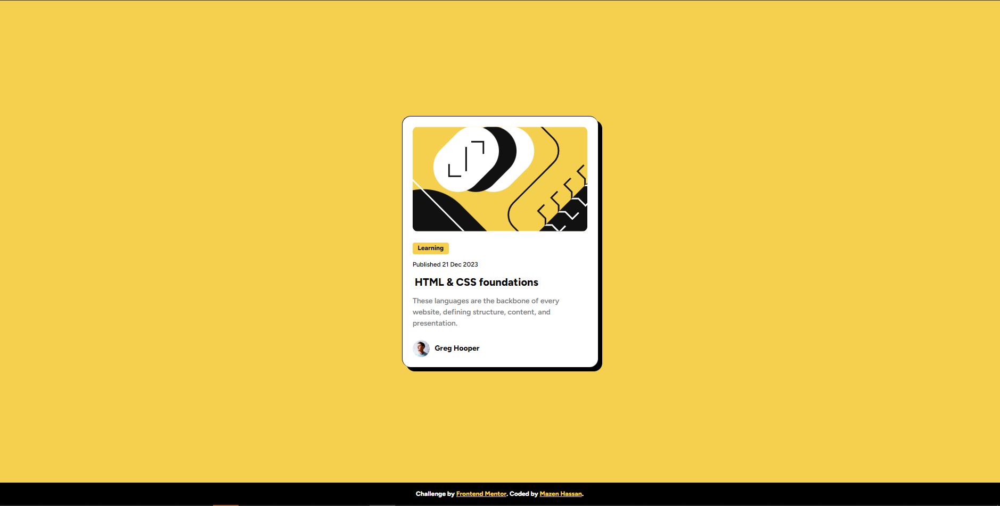

# Frontend Mentor - Blog preview card solution

This is a solution to the [Blog preview card challenge on Frontend Mentor](https://www.frontendmentor.io/challenges/blog-preview-card-ckPaj01IcS). Frontend Mentor challenges help you improve your coding skills by building realistic projects. 

## Table of contents

- [Frontend Mentor - Blog preview card solution](#frontend-mentor---blog-preview-card-solution)
  - [Table of contents](#table-of-contents)
    - [The challenge](#the-challenge)
    - [Screenshot](#screenshot)
    - [Links](#links)
    - [Built with](#built-with)
    - [What I learned](#what-i-learned)
    - [Continued development](#continued-development)
    - [Useful resources](#useful-resources)

### The challenge

Users should be able to:

- See hover and focus states for all interactive elements on the page

### Screenshot

### Links

- Solution URL: [Solution Link](https://your-solution-url.com)
- Live Site URL: [Live Site](https://blog-preview-card-nu-six.vercel.app/)

### Built with

- Semantic HTML5 markup
- CSS custom properties
- Flexbox
- Mobile-first workflow
- [Styled Components](https://sass-lang.com/) - For styles

### What I learned

In this project:

- I practiced with rem and em relative units for all my values.
- Learned more about transitions and pseudo classes using SCSS.

### Continued development
- I want to keep practicing and learn more about pseudo classes like ::before,::after and understand how to use effeciently.
- Practice more with transitions and achieve more smoother transitions.

### Useful resources

- [Example resource 1](https://css-irl.info/animating-underlines/) - This helped me with underline transition and pseudo-classes. I will definitely use it again in future projects.